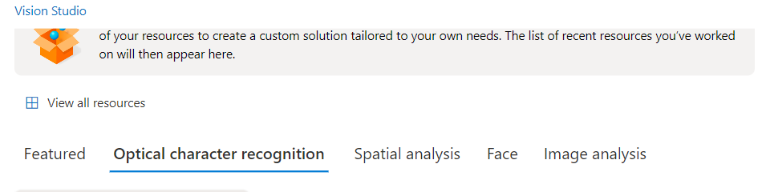

# Desafio-AI-Vision-Service
Repo criado para documentar experiência de projeto de tratamento de imagens com AI, utilizando como recurso o [Vision Studio](https://portal.vision.cognitive.azure.com).

Ao acessar o [Vision Studio](https://portal.vision.cognitive.azure.com) , bastou clicar em View all resources para selecionar um resource existente ou caso não tenha nenhum, é possível criar antes seguindo estes passos:

- Accessar [Portal Azure](https://portal.azure.com)
- Menu lateral > Criar um recurso
- Categorias > IA + Machine Learning
- Azure AI services > [Create](https://portal.azure.com/#create/Microsoft.CognitiveServicesAllInOne)

E para configuração:

- Selecione um **Resource group** existente ou crie um novo conforme preferir;
- **Region**: **East US**(sugerido pelo custo reduzido, se comparado a outros lugares)
- **Pricing tier**: Standard S0; Como se trata de um laboratório para estudos, atende sem gerar impedimento.
- marcar checkbox de termos > Review + Create > Create.

----

Dentre as opções disponíveis, temos:

- Optical character recognition: Reconhecimento/Digitalização de caracteres em imagem;
- Spatial analysis: Análise de ambiente, categorizando itens identificados;
- Face: Reconhecimento rostos;
- Image analysis: Identificação/descrição imagem.

Usei a própria ferramenta com a opção `Optical character recognition` para identificar as opções de menus do Vision Studio:

Ao ver o resultado, é possível perceber que os menus foram identificados, porém, a identificação não leva em consideração elementos da página pra dividir qual palavra representa qual menu: como resultado, o reconhecimento identificou `Opticalcharacterrecognition` numa linha e `SpatialanalysisFaceImageanalysis` em outra, como se fossem 2 menus apenas.

----

No caso de reconhecimento de cartas manuscritas, maioria do texto foi reconhecido, havendo trocas dentro do esperado. Ex.: letra `O` pelo número `0`, `0` por `@` , `áci` por `an`.

Tanto reconhecimento de caracteres impessos quanto manuscritos tem uma boa taxa de acerto, o que leva a pensar que podem ser ótimas ferramentas para digitalização e categorização de arquivos, ou mesmo de uma base de conhecimento, que poderia inclusive, servir de base de conhecimento a um chatbot, facilitando tratativa de problemas, por exempplo.

----

Para opção Face, percebi que os rostos quando não direcionados a câmera ou em imagem com cores similares e muito ruído não foram reconhecidos.

----

Porém, com a opção Image analysis(Add captions to images) isto não foi problema, sendo uma boa opção para acessibilidade por exemplo, por dar contextos acertivos as imagens testadas.

